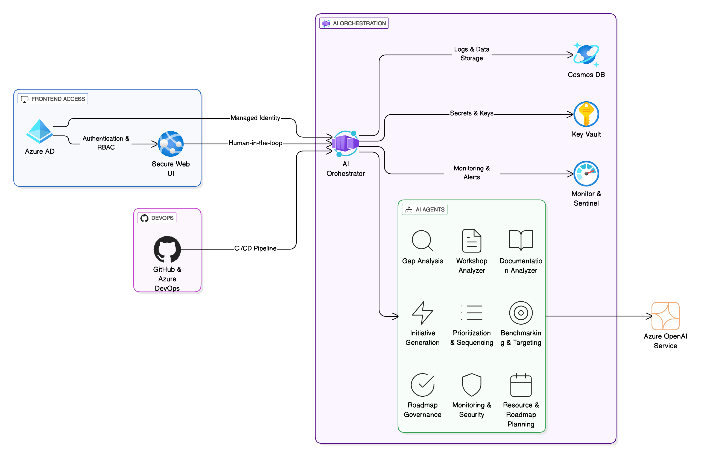

# 🚀 Cyber AI-Enabled Maturity Assessment Solution

## Overview

This repository contains Deloitte’s Cyber AI-Enabled Maturity Assessment Solution—a secure, Azure-based platform that automates and streamlines cybersecurity maturity assessments for consultants and clients.  
It uses advanced AI agents to analyze workshops, review documentation, identify gaps, benchmark against standards, generate recommendations, and produce professional reports.

---

## Key Features

- **Automated Cyber Maturity Assessments:** AI-driven support for all phases—workshops, evidence collection, analysis, and reporting.
- **Multi-Agent Orchestration:** Modular agents for workshop analysis, document review, benchmarking, gap analysis, initiative generation, and reporting.
- **Consultant-Friendly Workflows:** Simple web interface, actionable dashboards, and explainable AI outputs.
- **End-to-End Security & Compliance:** Azure-native, GDPR-ready, ISO 27001 and NIST CSF aligned.

---

## Solution Architecture

**Main Components:**
- **Web Interface (Azure App Service):** Secure portal for consultants
- **AI Orchestrator (Azure Container Apps):** Central logic hub
- **AI Agents:**
  - Workshop Analyzer: Real-time guidance during workshops
  - Documentation Analyzer: Reviews uploaded docs for evidence
  - Gap Analysis: Identifies gaps and generates recommendations
  - Benchmarking & Targeting: Industry comparison and target setting
  - Initiative Generator: Suggests projects to close gaps
  - Prioritization Agent: Ranks initiatives for impact
  - Roadmap Planner: Builds timelines/resources
  - Report Generator: Creates professional deliverables
  - Monitoring Agent: Tracks operations and detects anomalies
- **Azure OpenAI Service:** Advanced AI and language processing
- **Azure Cosmos DB:** Secure data and audit log storage
- **Azure Key Vault:** Manages secrets and keys
- **Azure Active Directory:** Secure identity and RBAC
- **Monitoring & Logging:** Azure Monitor, Sentinel
- **Infrastructure-as-Code:** Bicep/Terraform for Azure deployment

---

## How It Works: Consultant Workflow

1. **Login:** Consultant signs in securely via Azure AD.
2. **Start Assessment:** Create a new project, select standards (NIST, ISO, etc.).
3. **Workshop:** AI suggests live follow-ups/questions during client sessions.
4. **Upload Documents:** AI analyzes client documentation and maps maturity.
5. **Review Results:** Automated gap analysis, recommendations, and benchmarks provided for consultant review.
6. **Build Roadmap:** AI agents suggest initiatives and a clear action plan.
7. **Generate Reports:** Click to generate executive-ready, customizable reports.
8. **Continuous Monitoring:** Ongoing risk alerts and improvements.

