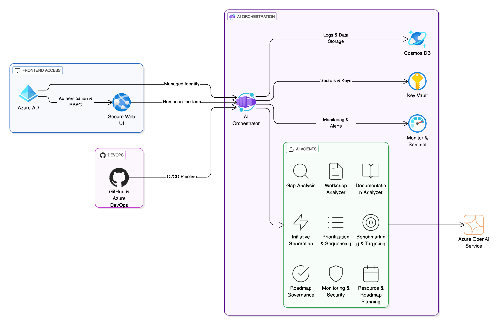

# Cyber AI-Enabled Maturity Assessment Solution

## Overview
Deloitte's Cyber AI-Enabled Maturity Assessment Solution is an Azure-based platform that helps
consultants perform cybersecurity maturity assessments. It leverages a set of AI agents and an
orchestrator to analyze workshops, review documentation, identify gaps, and produce professional
reports.

## Quick Start
1. `python -m venv .venv && source .venv/bin/activate`
2. `pip install -r requirements/backend.txt`
3. `npm ci --prefix src/frontend`
4. `pytest`
5. `python -m src.orchestrator`

## Solution Architecture


## Repository Structure
```
.
├── docker/              # Container build definitions
│   ├── backend/Dockerfile
│   └── frontend/Dockerfile
├── src/                 # Application source code
│   ├── agents/
│   ├── auth/
│   ├── backend/
│   ├── frontend/
│   ├── orchestrator/
│   ├── tools/
│   └── utils/
├── infra/               # Infrastructure-as-code templates
│   ├── modules/
│   └── main.bicep
├── docs/
│   ├── architecture/
│   │   ├── ARCHITECTURE.md
│   │   └── diagrams/
│   ├── DeploymentGuide.md
│   ├── LocalDeployment.md
│   └── ManualAzureDeployment.md
├── tests/               # Unit, integration, and e2e tests
├── pipelines/           # CI/CD definitions
│   └── azure-dev.yml
├── config/              # Configuration samples
├── requirements/        # Python dependency lists
└── README.md
```

## Development
- `docker/backend/Dockerfile` builds the API container
- `docker/frontend/Dockerfile` builds the web UI container
- `pipelines/azure-dev.yml` deploys infrastructure and application

## Contributing & License
See `CONTRIBUTING.md` for contribution guidelines and `LICENSE` for license information.
