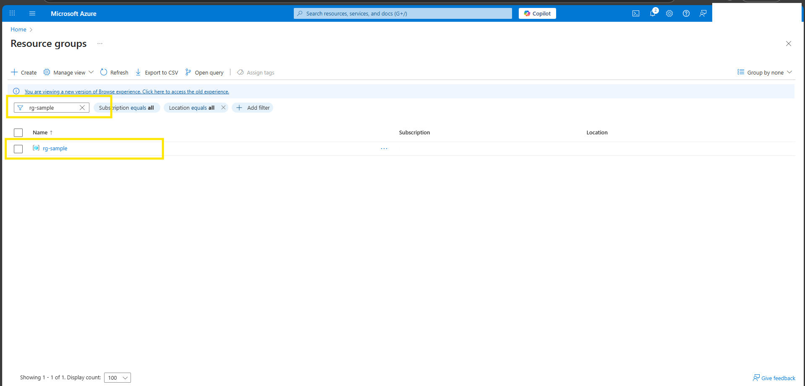

# 🛠️ Troubleshooting
 
## Enable `AllowBringYourOwnPublicIpAddress` Feature
 
Before deploying the resources, you may need to enable the **Bring Your Own Public IP Address** feature in Azure. This is required only once per subscription.
 
### Steps
 
1. **Run the following command to register the feature:**
 
   ```bash
   az feature register --namespace Microsoft.Network --name AllowBringYourOwnPublicIpAddress
   ```
 
2. **Wait for the registration to complete.**
    You can check the status using:
 
    ```bash
    az feature show --namespace Microsoft.Network --name AllowBringYourOwnPublicIpAddress --query properties.state 
    ```
 
3. **The output should show:**
    "Registered"
 
4. **Once the feature is registered, refresh the provider:**
 
    ```bash
    az provider register --namespace Microsoft.Network
    ```
 
    💡 Note: Feature registration may take several minutes to complete. This needs to be done only once per Azure subscription.

## Steps to avoid `ResourceGroupNotFound` Error

Before starting the deployment, ensure that the target resource group exists in your Azure subscription. Here are the steps to verify.

### Steps
 
1. Go to [Azure Portal](https:/portal.azure.com/#home).

2. Click on the **"Resource groups"** option available on the Azure portal home page.


3. In the Resource Groups search bar, search for the resource group you intend to target for deployment. If it exists, you can proceed with using it.


    💡 Note: If you encounter any other issues, please feel free to reach out to us. Thank you!
     

